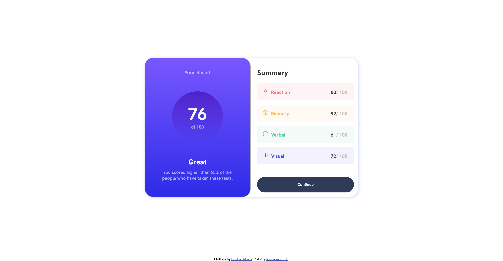

# Frontend Mentor - Results summary component solution

This is a solution to the [Results summary component challenge on Frontend Mentor](https://www.frontendmentor.io/challenges/results-summary-component-CE_K6s0maV). Frontend Mentor challenges help you improve your coding skills by building realistic projects. 

## Table of contents

- [Overview](#overview)
  - [The challenge](#the-challenge)
  - [Screenshot](#screenshot)
  - [Links](#links)
- [My process](#my-process)
  - [Built with](#built-with)
  - [What I learned](#what-i-learned)
  - [Continued development](#continued-development)
- [Author](#author)
- [Acknowledgments](#acknowledgments)

**Note: Delete this note and update the table of contents based on what sections you keep.**

## Overview

### The challenge

Users should be able to:

- View the optimal layout for the interface depending on their device's screen size
- See hover and focus states for all interactive elements on the page
- **Bonus**: Use the local JSON data to dynamically populate the content

### Screenshot




### Links

- Solution URL: [GitHub URL](https://github.com/RaviBele/FrontEnd-ResultSummary)
- Live Site URL: [Netlify URL](https://zesty-moxie-4c82e9.netlify.app/)

## My process

### Built with

- Semantic HTML5 markup
- CSS custom properties
- Flexbox
- Mobile-first workflow


**Note: These are just examples. Delete this note and replace the list above with your own choices**

### What I learned

Use this section to recap over some of your major learnings while working through this project. Writing these out and providing code samples of areas you want to highlight is a great way to reinforce your own knowledge.

To see how you can add code snippets, see below:

```css
html, body {
    margin: 0;
    padding: 0;
    box-sizing: border-box;
}

.main {
    display: inline-flex;
    flex-wrap: wrap;
    justify-content: center;
}

```
```js
fetch('./data.json').then((res) => {
        if (!res.ok)  {
            console.error('Invalid data path: ' + res.path);
        }
        return res.json();
    }).then((data) => {
        console.log(data);
    }).catch((error) => {
        console.error("Unable to fetch data:", error);
    });
```

### Continued development

More accurate dimensions according to image dimensions.


## Author

- Frontend Mentor - [@yourusername](https://www.frontendmentor.io/profile/RaviBele)


## Acknowledgments

This is where you can give a hat tip to anyone who helped you out on this project. Perhaps you worked in a team or got some inspiration from someone else's solution. This is the perfect place to give them some credit.
